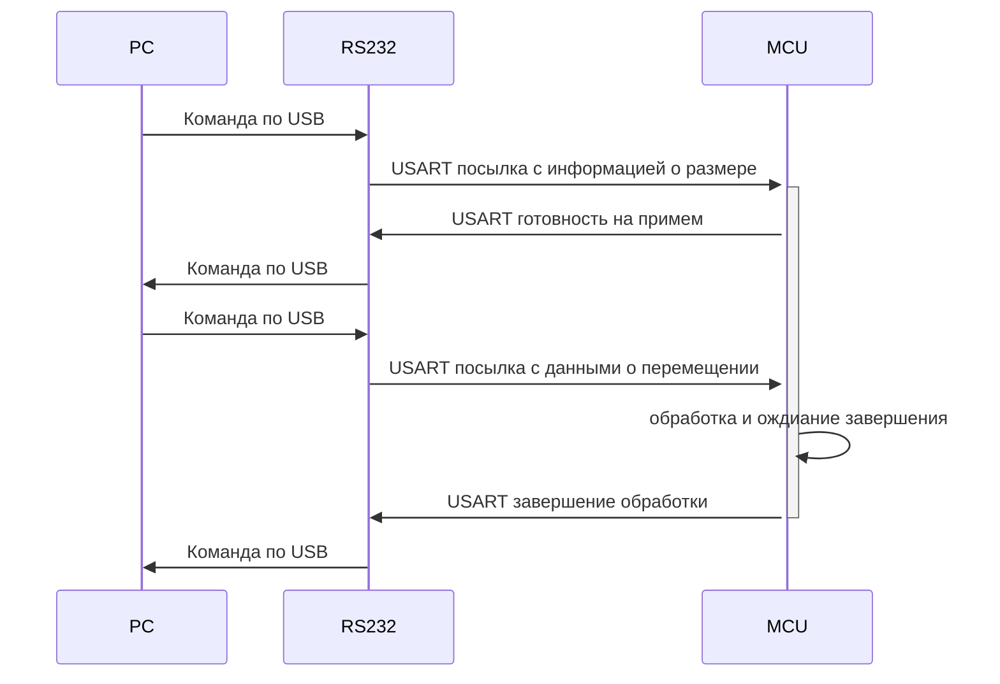

# Интерфейс взаимодействия с платой управления моторами

## Обзор архитектуры

Система состоит из трех компонентов:
- **PC** - сервер MotorControlService
- **RS232** - модуль FTDI FT232RL (мост USB ↔ USART)
- **MCU** - микроконтроллер управления моторами

## Протокол команд микроконтроллера

### Формат команд (1 байт)

| Биты | Команда | Описание |
|------|---------|----------|
| `1|0|0|0|N|N|N|N` | Синхронный запуск | Запуск всех ШД одновременно, N = количество моторов (1-10) |
| `0|1|0|0|N|N|N|N` | Асинхронный запуск | Запуск по мере готовности, N = количество моторов (1-10) |
| `0|0|1|0|0|0|0|0` | Запрос версии | Получение информации о прошивке |

### Примеры команд:
- `0b10000001` (0x81) - синхронный запуск 1 мотора
- `0b10000010` (0x82) - синхронный запуск 2 моторов
- `0b10001010` (0x8A) - синхронный запуск 10 моторов
- `0b01000001` (0x41) - асинхронный запуск 1 мотора
- `0b01000010` (0x42) - асинхронный запуск 2 моторов
- `0b01001010` (0x4A) - асинхронный запуск 10 моторов
- `0b00100000` (0x20) - запрос версии прошивки

## API сервиса

### Доступные команды

| Команда | Описание | Параметры |
|---------|----------|-----------|
| `version()` | Получение версии прошивки | Нет |
| `moving(MotorsSettings)` | Управление моторами | Настройки моторов |
| `reconnect(id)` | Переподключение к устройству | ID устройства |
| `disconnect()` | Отключение от устройства | Нет |
| `listconnect()` | Список доступных устройств | Нет |

## Структуры данных

### mms::Motor
```json
{
    "number": 1,           // Номер мотора (1-10)
    "acceleration": 2000,  // Ускорение (>0)
    "maxSpeed": 5000,      // Максимальная скорость (>0)
    "step": 100            // Количество шагов (может быть отрицательным)
}
```

### mms::MotorsSettings
```json
{
    "mode": "synchronous",  // Режим: "synchronous" | "asynchronous"
    "motors": [
        {"number": 1, "acceleration": 2000, "maxSpeed": 5000, "step": 100},
        {"number": 2, "acceleration": 1500, "maxSpeed": 4500, "step": -50}
    ]
}
```

### mms::Version
```json
{
    "version": 1.2,        // Версия прошивки (x.y)
    "name": "Squid"        // Имя устройства
}
```

### mms::Device
```json
{
    "deviceId": 0          // ID устройства (>=0)
}
```

### mms::ListConnect
```json
{
    "listConnect": ["COM0", "COM1"]  // Список доступных устройств
}
```

### mms::Manager
```json
{
    "command": "version",  // Команда для выполнения
    "message": ""         // Параметры команды (JSON)
}
```

## Последовательность взаимодействия



### 1. Команда version()

**Запрос:**
```json
{
    "command": "version",
    "message": ""
}
```

**Процесс:**
1. PC → RS232: Команда по USB
2. RS232 → MCU: USART пакет с информацией о размере
3. MCU → RS232: USART готовность на прием
4. RS232 → PC: Команда по USB (подтверждение готовности)
5. PC → RS232: Команда по USB (0x20 - запрос версии)
6. RS232 → MCU: USART пакет с командой версии
7. MCU → RS232: USART ответ с версией (1 байт)
8. RS232 → PC: Команда по USB с версией

**Ответ:**
```json
{
    "status": 0,
    "what": "mms::Version",
    "subMessage": "{\"version\":1.2,\"name\":\"Squid\"}"
}
```

## Протокол работы с моторами

### Детальная последовательность команды moving()

1. **Отправка команды режима и количества моторов**
   - PC отправляет 1 байт: `0x8N` (синхронный) или `0x4N` (асинхронный)
   - N = количество моторов (1-10)

2. **Подтверждение готовности MCU**
   - MCU отвечает 1 байтом:
     - `0x00` - все корректно, готов к приему данных
     - `!= 0x00` - ошибка (см. коды ошибок готовности)

3. **Отправка параметров моторов**
   - Формируется массив данных: для каждого мотора 4 параметра по 4 байта `uint32_t`
   - Порядок параметров для каждого мотора:
     - `number` (4 байта) - номер мотора
     - `acceleration` (4 байта) - ускорение
     - `maxSpeed` (4 байта) - максимальная скорость
     - `step` (4 байта) - количество шагов
   - Общий размер: `количество_моторов × 16 байт`

4. **Обработка на MCU и таймаут**
   - MCU начинает обработку команд
   - В сервисе запускается таймер ожидания
   - Если таймер срабатывает до получения ответа - ошибка таймаута

5. **Ответ о завершении работы**
   - MCU отправляет 1 байт результата:
     - `0xFF` - операция выполнена успешно
     - `!= 0xFF` - ошибка выполнения (см. коды ошибок выполнения)

6. **Ответ сервиса клиенту**
   - При успехе: `status = 0`, пустые `what` и `subMessage`
   - При ошибке: соответствующий код ошибки

### Коды ошибок готовности MCU (шаг 2)

| Код | Описание |
|-----|----------|
| 0x01 | Некорректное количество моторов |
| 0x02 | Некорректный режим работы |
| 0x03 | MCU занят другой операцией |
| 0x04 | Недостаточно памяти для обработки |
| 0x05 | Ошибка инициализации моторов |
| 0x06 | Ошибка конфигурации портов |
| 0x07 | Ошибка таймеров |
| 0x08 | Ошибка DMA |
| 0x09 | Ошибка прерываний |
| 0x0A | Общая ошибка системы |

### Коды ошибок выполнения (шаг 5)

| Код | Описание |
|-----|----------|
| 0x01 | Ошибка инициализации мотора |
| 0x02 | Превышение максимальной скорости |
| 0x03 | Ошибка расчета ускорения |
| 0x04 | Ошибка позиционирования |
| 0x05 | Механическая ошибка (заклинивание) |
| 0x06 | Перегрев драйвера |
| 0x07 | Ошибка питания |
| 0x08 | Ошибка связи с драйвером |
| 0x09 | Превышение лимитов движения |
| 0x0A | Ошибка калибровки |
| 0x0B | Аварийная остановка |
| 0x0C | Ошибка синхронизации (для синхронного режима) |
| 0x0D | Таймаут выполнения команды |
| 0x0E | Ошибка чтения энкодера |
| 0x0F | Общая ошибка выполнения |

### Коды ошибок сервиса

| Код | Описание |
|-----|----------|
| 40511 | Таймаут ожидания ответа от MCU |
| 40512 | Ошибка готовности MCU (код != 0x00) |
| 40513 | Ошибка выполнения на MCU (код != 0xFF) |
| 40514 | Ошибка отправки параметров моторов |
| 40515 | Некорректный размер данных для отправки |

### Пример команды moving()

**Запрос:**
```json
{
    "command": "moving",
    "message": "{\"mode\":\"synchronous\",\"motors\":[{\"number\":1,\"acceleration\":2000,\"maxSpeed\":5000,\"step\":100},{\"number\":2,\"acceleration\":1500,\"maxSpeed\":4500,\"step\":-50}]}"
}
```

**Успешный ответ:**
```json
{
    "status": 0,
    "what": "",
    "subMessage": ""
}
```

**Ответ при ошибке готовности MCU:**
```json
{
    "status": 40512,
    "what": "[client]: MCU readiness error: 0x03 (MCU busy with another operation)",
    "subMessage": ""
}
```

**Ответ при ошибке выполнения:**
```json
{
    "status": 40513,
    "what": "[client]: MCU execution error: 0x05 (Mechanical error - motor jammed)",
    "subMessage": ""
}
```

**Ответ при таймауте:**
```json
{
    "status": 40511,
    "what": "[client]: Timeout waiting for MCU response",
    "subMessage": ""
}
```

### Формат данных для отправки на MCU

Для команды moving() с 2 моторами данные будут выглядеть так:

```
Байт 0: 0x82 (синхронный режим, 2 мотора)
Байт 1: 0x00 (подтверждение готовности от MCU)
Байты 2-33: Данные моторов (2 мотора × 16 байт):
  Мотор 1:
    Байты 2-5:   number = 1 (0x00000001)
    Байты 6-9:   acceleration = 2000 (0x000007D0)
    Байты 10-13: maxSpeed = 5000 (0x00001388)  
    Байты 14-17: step = 100 (0x00000064)
  Мотор 2:
    Байты 18-21: number = 2 (0x00000002)
    Байты 22-25: acceleration = 1500 (0x000005DC)
    Байты 26-29: maxSpeed = 4500 (0x00001194)
    Байты 30-33: step = -50 (0xFFFFFFCE)
Байт 34: 0xFF (успешное завершение от MCU)
```

**Запрос:**
```json
{
    "command": "reconnect",
    "message": "{\"deviceId\":0}"
}
```

**Ответ при успехе:**
```json
{
    "status": 0,
    "what": "",
    "subMessage": ""
}
```

### 3. Команда reconnect(id)

**Запрос:**
```json
{
    "command": "reconnect",
    "message": "{\"deviceId\":0}"
}
```

**Ответ при успехе:**
```json
{
    "status": 0,
    "what": "",
    "subMessage": ""
}
```

### 4. Команда disconnect()

**Запрос:**
```json
{
    "command": "disconnect",
    "message": ""
}
```

**Ответ при успехе:**
```json
{
    "status": 0,
    "what": "",
    "subMessage": ""
}
```

### 5. Команда listconnect()

**Запрос:**
```json
{
    "command": "listconnect",
    "message": ""
}
```

**Ответ:**
```json
{
    "status": 0,
    "what": "mms::ListConnect",
    "subMessage": "{\"listConnect\":[\"Device 0: FT232R USB UART - A50285BI\",\"Device 1: FT232R USB UART - A50285BJ\"]}"
}
```

## Коды ошибок

| Код | Описание |
|-----|----------|
| 40401 | Ошибка десериализации основного сообщения |
| 40402 | Ошибка десериализации MotorsSettings |
| 40403 | Ошибка десериализации Device |
| 40501 | Некорректный режим работы ("synchronous" или "asynchronous") |
| 40502 | Превышено максимальное количество моторов (>10) |
| 40503 | Некорректный номер мотора (должен быть 1-10) |
| 40504 | Нулевое ускорение мотора |
| 40505 | Нулевая максимальная скорость мотора |
| 40506 | Сообщение должно быть пустым для данной команды |
| 40507 | Модуль не подключен |
| 40509 | Некорректный ID устройства (<0) |
| 40510 | Ошибка подключения к устройству |
| 40512 | Модуль уже подключен |

## Особенности реализации

### Кодирование версии
Версия прошивки кодируется одним байтом:
- Старшие 4 бита - целая часть версии
- Младшие 4 бита - дробная часть версии
- Пример: версия 1.3 → `0x13` (0001 0011)

### Валидация параметров моторов
- Количество моторов: максимум 10
- Номер мотора: от 1 до 10
- Ускорение: больше 0
- Максимальная скорость: больше 0
- Шаги: любое целое число (может быть отрицательным)

### Режимы работы
- **synchronous**: все моторы запускаются одновременно (команда 0x8N, где N = количество моторов)
- **asynchronous**: моторы запускаются по мере готовности (команда 0x4N, где N = количество моторов)

### Кодирование количества моторов
Младшие 4 бита команды содержат количество моторов (1-10):
- 1 мотор: `0x81` (синхронный) или `0x41` (асинхронный)
- 2 мотора: `0x82` (синхронный) или `0x42` (асинхронный)
- 10 моторов: `0x8A` (синхронный) или `0x4A` (асинхронный)

## Текущие ограничения

1. **TODO #001**: Прописать коды ошибок при передаче
2. **TODO #002**: Возвращать ошибку при некорректных командах
3. **TODO #003**: Исправить проблемы с тестами

## Недостающая реализация

В текущей версии команда `moving()` только валидирует параметры, но не выполняет реальное управление моторами. Необходимо добавить:

1. Отправку команды режима (0x80/0x40) на микроконтроллер
2. Передачу параметров моторов (ускорение, скорость, шаги)
3. Обработку подтверждений от микроконтроллера
4. Обработку ошибок выполнения команд
